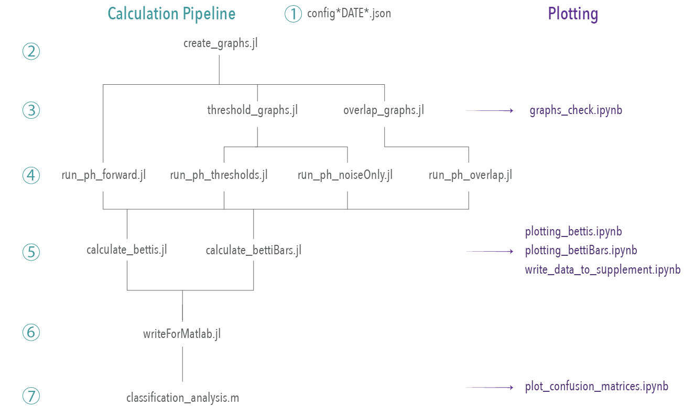

# Code for "Variability in higher order structure of noise added to weighted networks" arxiv 2021

### Resources
- arxiv [paper](https://arxiv.org/pdf/2101.03933.pdf)
- supplementary interactive visualizations [site](https://asizemore.github.io/noise_and_tda_supplement/)
- persistent homology software used: [Eirene](https://github.com/Eetion/Eirene.jl)
- configuration file [README](./configs/README.md)

----
This repository contains all the code necessary to reproduce the results found in the "Variability in higher order structure of noise added to weighted networks" paper. 

Given the computational intensity of some of the code, the graph generation and persistent homology calculations were performed using an available cluster. Still, the entire pipeline can be run on a local computer by reducing the number of nodes in the graphs and the maximum persistent homology dimension.

## Pipeline

## Code for calculations

 

### *Step 0: Setting up the container*

Included with the repository is all needed files to create a docker container in which to run this project. It is not necessary to run the code within the container, but it is highly recommended. 

To get started, download [Docker](https://www.docker.com/products/docker-desktop) and ensure it is running. In the terminal, navigate to this directory and run `make build` to build the container, and then `docker run -it --rm -p 8888:8888 -v $(pwd):/home/jovyan/ noise_detection:deploy-01` to run the container. 

 

### *Step 1: Prepare configuration file*

Each step of the process expects an input configuration file named with the date (see examples in the 'configs' folder). This .json file contains all the parameters needed for the calculations (number of nodes, maximum persistent homology dimension, etc.) and model networks. 

 

### *Step 2: Generate network models - create_graphs.jl*

Parameters from config file: `NREPS`, `NNODES`, `DATE_STRING`, `NAMETAG_creategraphs`, `graph_models`, `HOMEDIR`, `save_dir_graphs`

Running this script will generate `NREPS` graphs for every model listed in `graph_models` with `create_flag` set to "create". See graph_models.jl for the list of network models available. All graphs will have `NNODES` nodes and parameters as listed in the configuration file. Graphs are saved as an `NNODES` x `NNODES` x `NREPS` array in a .jld file with name and location determined by `NAMETAG_creategraphs` and `save_dir_graphs`.

 

### *Step 3a - Threshold graphs - threshold_graphs.jl*

Parameters from config file: `THRESHVEC`, `NNODES`, `DATE_STRING`, `SAVEDATA`, `SAVETAIL_threshold_graphs`, `HOMEDIR`

At this step we 1) threshold the networks and 2) add noise to the empty edges and 3) create a randomized version of the network. For every edge density rho listed in `THRESHVEC` and every model network `G_i`, we create `G_thresholded` in which only the top rho fraction of edges is kept, based on edge weight. We create a randomized copy `G_randomized` that has the same edges as `G_threshold`, but the edge weights have been randomized. We add noise to both `G_threshold` and `G_randomized` such that the noisy edges only fill in those edges not present in the graphs and all noisy edge weights are less than any in these graphs. Finally, we extract the noisy edges and make `G_noiseOnly` which contains the isolated added noise network. All networks are saved as before in .jld files.

 

### *Step 3b - Create overlapping noise graphs - overlap_graphs.jl*

Parameters from config file: `NNODES`, `AVEC`, `BVEC`, `DATE_STRING`, `HOMEDIR`, `read_dir_graphs`, `save_dir_overlap`

Here we take the graph models created in step 2 and construct the overlapping noise networks (Fig. 6). For each model network this code creates new networks in which the strongest edges are taken directly from the model, medium weight edges (determined by `AVEC` and `BVEC`) have an increasing probability of being generated from noise, and weak edges are all random noise. All networks are saved in .jld files.

 

### *Step 4a - Running persistent homology, no noise - run_ph_forward.jl*

Parameters from config file: `NNODES`, `DATE_STRING`, `SAVEDATA`, `MAXDIM`, `HOMEDIR`, `SAVETAIL_ph_forward`

**Note** This file has accompanying shell scripts for running on the cluster. Alternatively, use the local_loop.jl file to run locally.

This script takes as input the configuration file and a designated graph file, then computes the persistent homology using Eirene.

 

### *Step 4b - Running persistent homology with noise - run_ph_thresholds.jl, run_ph_noiseOnly.jl, run_ph_overlap.jl*

Parameters from config file: `NNODES`, `DATE_STRING`, `SAVEDATA`, `MAXDIM`, `HOMEDIR`, file-specific `read_dir `s and `save_dir`s.

**Note** These files has accompanying shell scripts for running on the cluster. Alternatively, use `local_loop.jl`, `local_loop_thresholds.jl` to run locally.

Similar to step 4a, this script calculates the persistent homology for one graph model. However, the `run_ph_threshold.jl` script uses the `weighted_graph_array_noise`, the `run_ph_noiseOnly.jl` script uses the `noise_only_array`, and the  stored within the graph .jld file for their computations.

 

### *Step 5 - Calculate topological summaries - calculate_bettis.jl, calculate_betti_bars.jl*

Parameters from config file: `NNODES`, `DATE_STRING`, `SAVETAIL_bettis`

For plotting and classification analyses, we need to calcualte the Betti curves and summariations of the barcode. Both `calculate_bettis.jl` and `calculate_betti_bars.jl` will perform calculations for all files with the proper tag ("eireneoutput") located in the designated read directory. Results are saved as arrays in .jld files.

 

### *Step 6 - Write results to .mat format - writeForMatlab.jl*

Parameters from config file: `NNODES`, `DATE_STRING`, `NNODES`, `SAVEDATA`, `MAXDIM`, `read_dir_results`, `save_dir_forMatlab`

Writes all relevant results to .mat files for later analyses.

 

### *Step 7 - Classification - classification_analysis.m*

Reads in barcode summaries and performs a classification using a generative Gaussian mixture model. Additionally plots confusion matrices and accuracy distributions.

 

## Code for plotting

- Betti curves: `plotting_bettis.ipynb`
- Network model properties: `graphs_check.ipynb`
- Write data for [interactive visualizations](https://asizemore.github.io/noise_and_tda_supplement/): `write_data_to_supplement.ipynb`
- Plotting all confusion matrices: `plot_confusion_matrices.ipynb`
- Barcode summary values (dev --  not used in final paper): `plotting_bettiBars.ipynb`

 

---

## Additional notes

### *Running locally - local_loop.jl, local_loop_thresholds.jl*

Use these scripts to run persistent homology locally. These files help to run a designated script (such as `run_ph_forward.jl`) over all appropriate files found within a directory.

### *Questions?*
My contact information can be found [here](https://www.aesizemore.com/).

